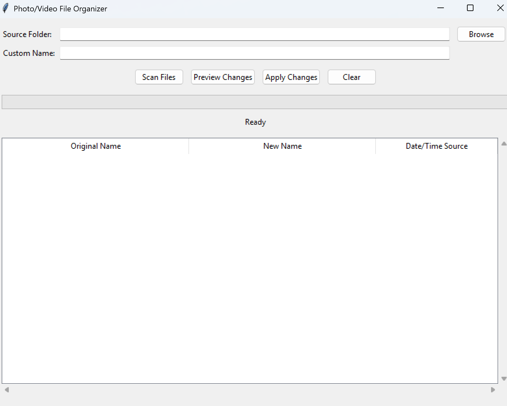
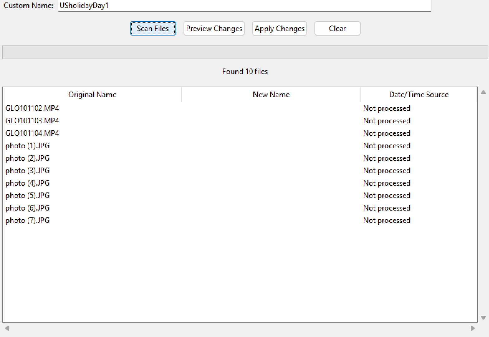
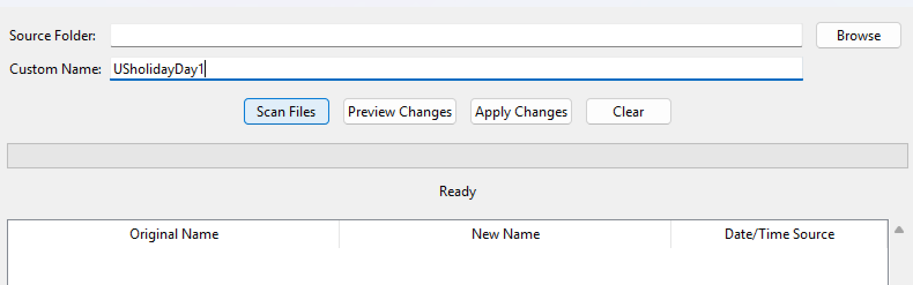
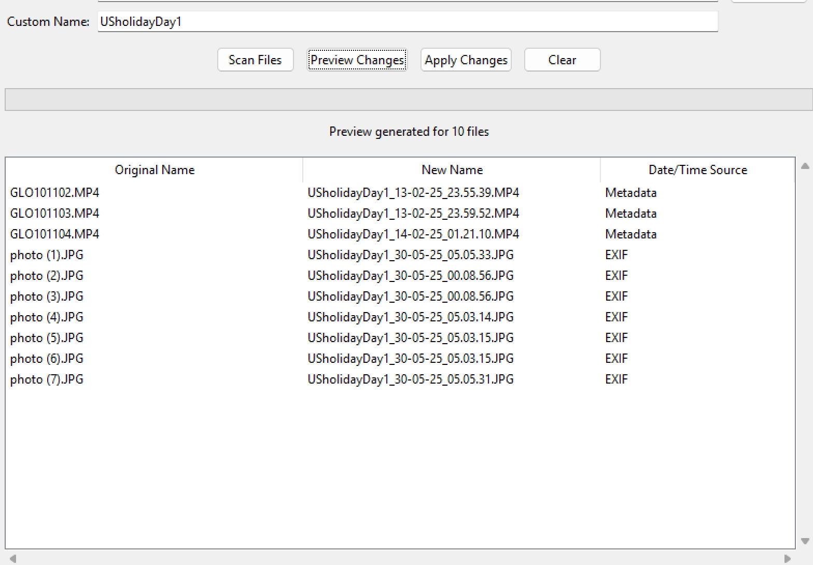
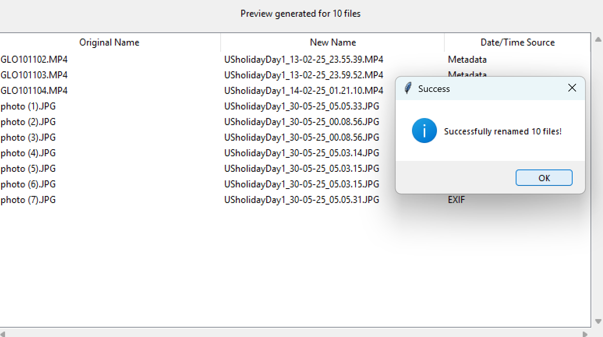
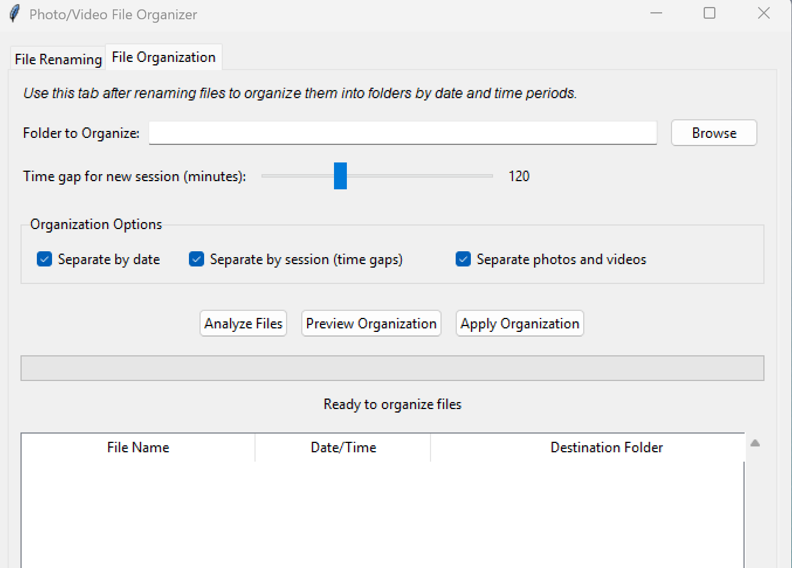

# PAVO

A Python Photo and Video batch renaming and organising tool. Pavo is also Spanish for Turkey!

{.img-responsive width=300px}

# Rationale
I couldn't find a simple tool to quickly rename and organise photo and video files taken on my GoPro and other cameras.
This tool allows the user to select a directory via a GUI and rename files, adding date and time taken. I intend to add a few other features but it's mainly designed for my own use.

# Useage

After starting the Script, browse to the folder which contains the files you wish to rename via the **'Browse'** button.

**Scan files** - reveals the folder contents with existing file names:

The text box **'Custom Name'** allows the user to create a meaningful name for the files e.g. 'USholidayDay1'.
The tool will add date taken and time taken to each file name.

Use the **'Preview Changes'** button to see how the new naming structure will look.

The final step is to rename the files. A success window will pop up once complete.

# Folder Structre Organisation
Ive added a second tab to the gui to allow folder creation and organisation. Once files are successfully renamed you might want to further group them. The **'File Organisation'** Tab helps with this

Use **'Browse'** to select the folder to organise. 

Checkbox selectable options include:
**Seperate by date** - you may want to create individual folders for each day

**Seperate by session** - you may have a group of files taken during one time period and another later, which you want to seperate - the time gap is adjustable via the **'Time gap for new session (minutes)''** slider.

**'Seperate photos and videos'** is also an option.

Once organisation options are selected the files can again be analysed, the organisation previewed and applied. This still might need some work so use with caution - no undo button yet!
